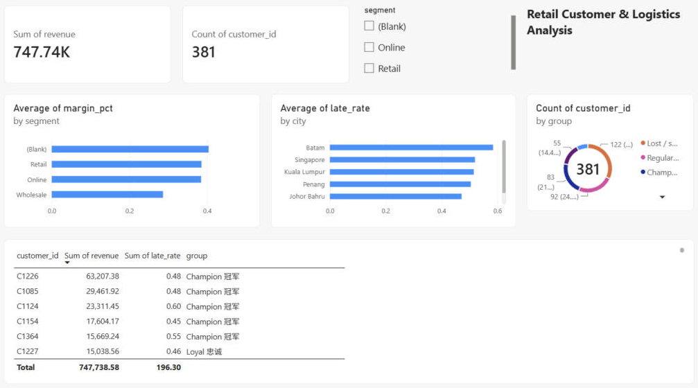
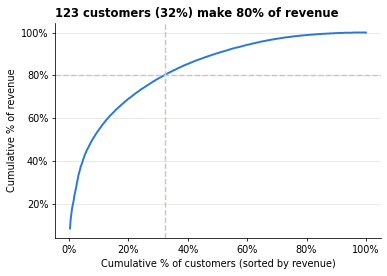
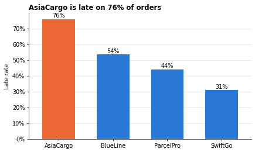
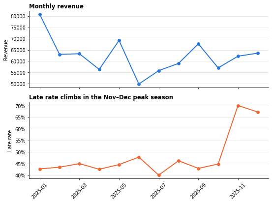

# Retail Customer & Logistics Analysis with Pandas

An end-to-end data-aggregation project: joining five related tables (customers, orders, products, returns, shipments), checking data quality, and turning 6,000 order lines into customer-level insights, a Pareto view, RFM segments and logistics KPIs — finished with charts and a business-value summary.

> **Note:** the data is synthetic (generated for practice). The numbers illustrate the *method*, not a real company's results.

## Dashboard (Power BI)



One page built from the aggregated Excel output of the notebook (`retail_customer_logistics_dashboard.pbix`): total revenue and customer count, a segment slicer, margin % by segment, late-delivery rate by city, RFM customer groups, and a top-customer table. Python does the heavy lifting; Power BI presents it.

## Business questions

1. Who are our best customers, and how concentrated is revenue?
2. Which segment / city / category makes the most **profit** (not just sales)?
3. Which customers return goods too often, and why?
4. Are late deliveries hurting certain customers or cities?
5. Are there data-quality problems we must fix before trusting the numbers?

## Data (`data/` folder)

| File | Rows | Grain |
|---|---|---|
| `customers.csv` | 403 | one row per customer (contains 3 deliberate duplicates) |
| `orders.csv` | 6,000 | one row per order line — many per customer |
| `products.csv` | 30 | unit price and unit cost |
| `returns.csv` | 240 | orders that were returned, with reason |
| `shipments.csv` | 6,463 | parcels — some orders ship as 2 parcels |
| `carriers.csv` | 4 | service level and promised delivery days |

Relationship: `customers 1 → many orders 1 → many shipments`.

## Method (notebook steps)

1. **Load** all six tables and print shapes.
2. **Data-quality checks before joining** — duplicate keys (`duplicated`, `is_unique`), orphan keys (`isin`), relationship map.
3. **Build the order-level table** with `merge(..., validate='m:1')`; demonstrate the one-to-many trap (revenue overstated by 8.5% when shipments are joined directly) and fix it by aggregating shipments to one row per order first.
4. **Customer-level aggregation** — `groupby().agg()` with `nunique`, `first`, `min/max`, rates with correct denominators.
5. **Pareto** with `cumsum`, and equal-size tiers with `qcut`.
6. **`transform()`** for share-of-customer-total and running totals per customer.
7. **Profit by segment × category** with `pivot_table` (several values and functions).
8. **Returns analysis** — high-return customers, reason × category crosstab.
9. **Logistics KPIs** — late rate by carrier and city × carrier, shipping cost as % of revenue, late vs return rate.
10. **RFM scoring** and customer groups (Champion / Loyal / At risk / Sleeping).
11. **Export** summaries to Excel.
12. **Business value** — benefit, conclusions, ROI framing, impact.
13. **Charts** — bar and line charts with pandas / matplotlib.

## Key findings (synthetic data)

| Pareto: 32% of customers = 80% of revenue | Late rate by carrier |
|---|---|
|  |  |



- A naive join would overstate revenue by **8.5%** (463 split-parcel orders counted twice + 3 duplicate customers). The checks in Step 2–3 prevent this.
- **123 of 381 customers (32%) generate 80% of revenue.**
- Wholesale has the highest revenue per customer but the lowest margin (**~29% vs ~39%**) because of its 15% discount — sales ≠ profit.
- Overall return rate is 4%, but **15 customers** (≥ 5 orders) return ≥ 15% of orders.
- **~48% of orders arrive late**; the cheapest carrier (AsiaCargo) is late on **76%** of its orders. Late delivery does **not** increase returns in this data.
- RFM flags **29 "at-risk" customers** (high spend, gone quiet) worth ~102.6k — a ready-made win-back list.

## Skills demonstrated

`pandas` · `merge` with `validate` · one-to-many aggregation · `groupby` / `agg` / `transform` · `crosstab` · `pivot_table` · `cumsum` / Pareto · `qcut` · RFM segmentation · `matplotlib` charts · data-quality checks · business framing (benefit, ROI, decisions)

## How to run

```bash
pip install pandas matplotlib openpyxl
jupyter notebook retail_customer_logistics_analysis.ipynb
```

The notebook reads from `./data/` relative to its own folder. Open `retail_customer_logistics_dashboard.pbix` in Power BI Desktop to explore the dashboard (it reads `retail_customer_summary.xlsx`, which the notebook creates in Step 11).

## Author

Joanne Goh — finance professional (AP/AR/GL, reconciliation, intercompany) transitioning into data analytics. [LinkedIn](https://www.linkedin.com/in/joannegohkp)
